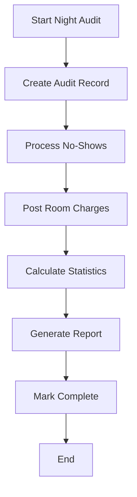

# Night Audit Module

> **Minimum Tier:** Professional  
> **Phase:** 2.2  
> **Status:** ✅ Complete

## Overview

The Night Audit module automates end-of-day accounting processes, including posting room charges, processing no-shows, generating reconciliation reports, and closing the business day.

## Features

### Audit Execution
- **Manual trigger** via API or scheduled
- **Room charge posting** for all occupied rooms
- **No-show processing** for pending arrivals
- **Revenue calculation** and tracking

### Reconciliation Reports
- **Daily Financial Summary** (DFR)
- **Occupancy Statistics** (ADR, RevPAR)
- **Arrival/Departure/Stayover counts**
- **No-show analysis**

### Audit Trail
- **Complete history** of all audit runs
- **User attribution** for manual audits
- **Error logging** for troubleshooting

## API Endpoints

| Method | Endpoint | Description |
|--------|----------|-------------|
| POST | `/night-audit/run` | Trigger night audit |
| GET | `/night-audit/audits` | List all audits |
| GET | `/night-audit/audits/{date}` | Get audit by date |
| GET | `/night-audit/latest` | Get most recent audit |
| GET | `/night-audit/reports/reconciliation/{date}` | Reconciliation report |

## Data Models

### NightAudit
```python
class NightAudit:
    id: int
    business_date: date
    started_at: datetime
    completed_at: datetime
    is_completed: bool
    
    # Revenue
    total_room_revenue: Decimal
    total_other_revenue: Decimal
    total_tax: Decimal
    total_payments: Decimal
    
    # Occupancy
    rooms_occupied: int
    rooms_available: int
    rooms_out_of_service: int
    occupancy_percentage: Decimal
    
    # Activity
    no_shows_processed: int
    no_show_revenue_lost: Decimal
    room_charges_posted: int
    
    run_by_id: int  # User who triggered audit
```

### RoomCharge
```python
class RoomCharge:
    id: int
    night_audit_id: int
    booking_id: int
    room_number: str
    business_date: date
    room_rate: Decimal
    tax_amount: Decimal
    total_charge: Decimal
    is_posted: bool
```

## Reconciliation Report Fields

```python
{
    "business_date": "2026-01-07",
    
    # Revenue
    "room_revenue": 5000.00,
    "other_revenue": 500.00,
    "total_revenue": 5500.00,
    "total_tax": 550.00,
    "gross_total": 6050.00,
    
    # Payments
    "total_payments": 4000.00,
    "outstanding_balance": 2050.00,
    
    # Occupancy Metrics
    "rooms_occupied": 40,
    "rooms_available": 8,
    "rooms_out_of_service": 2,
    "occupancy_rate": 80.00,
    "average_daily_rate": 125.00,  # ADR
    "revenue_per_available_room": 100.00,  # RevPAR
    
    # Activity
    "arrivals": 10,
    "departures": 8,
    "stayovers": 30,
    "no_shows": 2,
    "room_charges_posted": 40
}
```

## Night Audit Process



### Step Details

1. **Process No-Shows**
   - Find bookings with check-in = business_date
   - Status = PENDING (never checked in)
   - Mark as NO_SHOW
   - Track revenue lost

2. **Post Room Charges**
   - Find all CONFIRMED bookings overlapping business date
   - Calculate daily rate per booking
   - Create RoomCharge records
   - Sum total revenue

3. **Calculate Statistics**
   - Occupancy % = Occupied / Total Rooms
   - ADR = Room Revenue / Occupied Rooms
   - RevPAR = Room Revenue / Available Rooms

## Usage Examples

### Run Night Audit
```bash
curl -X POST http://localhost:8000/night-audit/run \
  -H "Authorization: Bearer $TOKEN" \
  -H "Content-Type: application/json" \
  -d '{"business_date": "2026-01-07"}'
```

### Get Reconciliation Report
```bash
curl http://localhost:8000/night-audit/reports/reconciliation/2026-01-07 \
  -H "Authorization: Bearer $TOKEN"
```

### List Audit History
```bash
curl http://localhost:8000/night-audit/audits?limit=30 \
  -H "Authorization: Bearer $TOKEN"
```

## Configuration

### Enable Module
```env
NEXT_PUBLIC_FEATURE_NIGHT_AUDIT=true
```

### Scheduling (Future)
```python
# Auto-run night audit at 2:00 AM
NIGHT_AUDIT_AUTO_RUN = True
NIGHT_AUDIT_RUN_TIME = "02:00"
NIGHT_AUDIT_TIMEZONE = "America/New_York"
```

### Tax Configuration
```python
# Default tax rate for room charges
ROOM_TAX_RATE = 0.10  # 10%
```

## Files Reference

| File | Purpose |
|------|---------|
| `app/models/night_audit.py` | NightAudit & RoomCharge models |
| `app/schemas/night_audit.py` | Pydantic schemas |
| `app/services/night_audit_service.py` | Audit business logic |
| `app/routers/night_audit.py` | API endpoints |

## Dependencies

- **Bookings Module:** For active bookings and no-show detection
- **Room Types Module:** For total room counts
- **Customers Module:** For guest data (optional)

## Best Practices

1. **Run at end of business day** (typically 2-3 AM)
2. **Review no-shows** before finalizing
3. **Verify revenue totals** against POS systems
4. **Keep audit history** for at least 7 years (compliance)
5. **Don't re-run completed audits** (creates duplicates)
